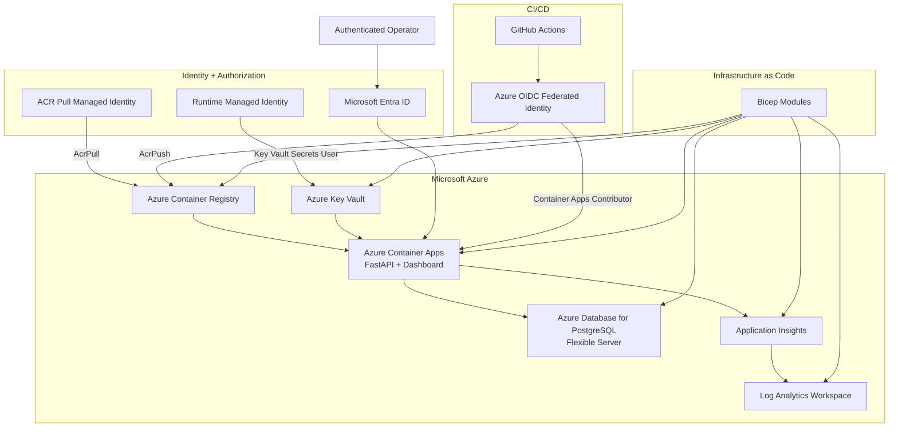
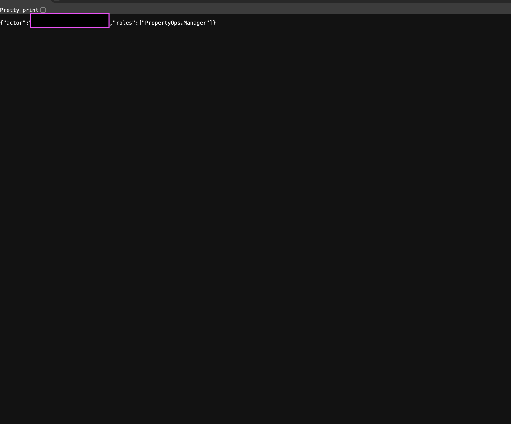
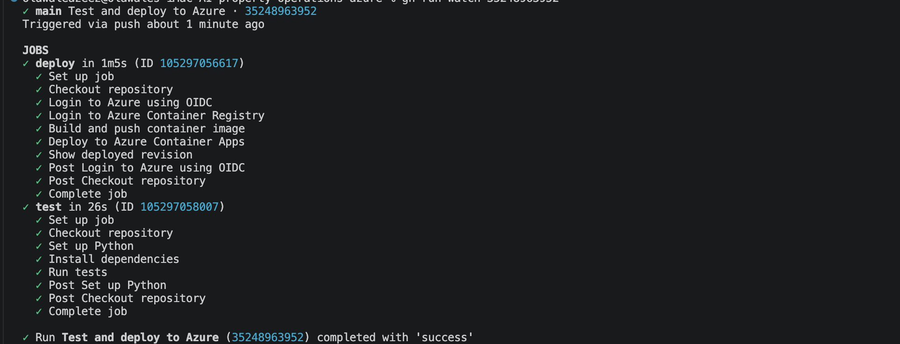

# PropertyOps AI Agent


PropertyOps is an Azure-hosted property operations platform for managing properties, maintenance requests, structured triage, human approval decisions, and audit history.

The project combines a FastAPI backend, browser-based operations workspace, PostgreSQL persistence, Microsoft Entra ID authentication, application-role authorization, managed identities, Azure Key Vault, observability, GitHub Actions CI/CD with Azure OIDC, and Infrastructure as Code with Bicep.

> **Deployment status:** Validated on Microsoft Azure  
> **Authentication:** Microsoft Entra ID  
> **Authorization:** `PropertyOps.User` and `PropertyOps.Manager`  
> **Decision boundary:** Triage can recommend actions, but approval and rejection remain human decisions.

---

## Project Overview


PropertyOps was built as a cloud engineering and platform engineering portfolio project rather than only as an application demo.

It demonstrates the lifecycle of a small production-style service:

```text
Application
    ↓
Containerization
    ↓
Azure deployment
    ↓
Managed database
    ↓
Identity + RBAC
    ↓
Secret management
    ↓
Observability
    ↓
CI/CD
    ↓
Infrastructure as Code
```

The application models a property maintenance workflow:

```text
Property
   ↓
Maintenance request
   ↓
Triage suggestion
   ↓
Human review
   ↓
Approve / Reject
   ↓
Maintenance state update
   ↓
Audit event
```

---

## Key Capabilities

- Property and maintenance-request management
- Searchable browser operations dashboard
- Deterministic rules-based triage
- Optional OpenAI-assisted triage
- Human approval and rejection workflow
- Audit history linked to authenticated users
- Microsoft Entra ID authentication
- Role-based application authorization
- PostgreSQL cloud persistence
- Azure Key Vault secret references
- User-assigned managed identities
- Least-privilege Azure RBAC
- Application Insights telemetry
- Log Analytics / KQL investigation
- Docker containerization
- GitHub Actions CI/CD
- Passwordless Azure deployment using GitHub OIDC
- Modular Bicep Infrastructure as Code

---

## Operations Workspace


The browser workspace provides operational views for:

| Area | Purpose |
| --- | --- |
| Maintenance | Create, search, triage, and review maintenance requests |
| Properties | Register properties and inspect maintenance workload |
| Approvals | Review proposed work and explicitly approve or reject it |
| Audit history | Inspect recorded human decisions |
| Triage status | Show whether deterministic rules or optional AI assistance is configured |

The dashboard is served directly by FastAPI, so the project does not require a separate frontend deployment.

---

## Azure Architecture



---

## Azure Platform


The deployed platform uses:

| Azure service | Responsibility |
| --- | --- |
| Azure Container Apps | Hosts the FastAPI application and dashboard |
| Azure Container Registry | Stores versioned Linux AMD64 container images |
| Azure Database for PostgreSQL | Provides persistent application storage |
| Azure Key Vault | Stores application secrets outside source control |
| Microsoft Entra ID | Authenticates application users |
| Managed Identity | Provides passwordless Azure resource authentication |
| Azure RBAC | Restricts identities to required resource actions |
| Application Insights | Captures application request telemetry |
| Log Analytics | Supports operational investigation with KQL |

---

## Authentication and Authorization

PropertyOps uses Microsoft Entra ID for authentication in Azure.

The Azure authentication layer supplies the authenticated principal to the application. FastAPI reads that principal and extracts the user's claims and application roles.

Two application roles are used:

```text
PropertyOps.User
PropertyOps.Manager
```

### `PropertyOps.User`

Authenticated users can:

- View properties
- Create properties
- View maintenance requests
- Submit maintenance requests
- Generate triage suggestions
- Create approval requests
- View approvals
- View audit history

### `PropertyOps.Manager`

Managers inherit normal user access and can additionally:

- Approve maintenance work
- Reject maintenance work

The application exposes:

```text
GET /me
```

which returns the authenticated actor and application roles without exposing credentials.



Example shape:

```json
{
  "actor": "authenticated-user",
  "roles": [
    "PropertyOps.Manager"
  ]
}
```

The screenshot used in the repository should redact personally identifying account information before publication.

---

## Human Approval Boundary


Triage and approval are intentionally separate.

```text
Maintenance issue
       ↓
Triage suggestion
       ↓
Human reviewer
       ↓
 ┌─────┴─────┐
 ↓           ↓
Approve    Reject
 ↓           ↓
Maintenance state
       ↓
Audit history
```

A triage suggestion may recommend:

- Priority
- Recommended trade
- Recommended action
- Rationale

It cannot independently:

- Approve work
- Reject work
- Dispatch a contractor
- Change the final maintenance decision

Approval and rejection require the:

```text
PropertyOps.Manager
```

role.

Duplicate pending approval requests and repeated decisions return HTTP `409`.

This maintains a clear human decision boundary even when AI-assisted triage is enabled.

---

## Audit History


Approval and rejection decisions are recorded independently from triage suggestions.

Each decision records information such as:

```text
Action
Resource
Previous status
New status
Authenticated actor
```

This preserves a clear distinction between:

```text
what the system suggested
```

and:

```text
what the authenticated human decided
```

Manager approval and rejection use the authenticated Microsoft Entra actor instead of a hard-coded application username.

This gives the workflow an auditable link between identity, authorization, and consequential actions.

---

## Triage Modes

PropertyOps supports two triage modes.

### Rules mode

Rules mode is the default:

```dotenv
TRIAGE_MODE=rules
```

It uses deterministic local logic and requires no external AI API.

### OpenAI mode

Optional AI-assisted triage can be enabled explicitly:

```dotenv
TRIAGE_MODE=openai
OPENAI_API_KEY=
OPENAI_MODEL=
```

AI-assisted triage can produce structured suggestions including:

- Priority
- Recommended trade
- Recommended action
- Rationale
- Suggestion source

AI remains advisory.

It cannot independently approve work or change the final maintenance decision.

If OpenAI mode is selected but unavailable or misconfigured, the application returns an error rather than silently switching to rules mode.

Use:

```text
GET /triage-config
```

to inspect the selected mode without revealing credentials or making an AI request.

---

## Persistence

PropertyOps supports separate local and Azure persistence models.

### Local development

Without `DATABASE_URL`, the application uses SQLite:

```text
FastAPI
   ↓
SQLite
   ↓
propertyops.db
```

### Azure deployment

The Azure deployment uses PostgreSQL:

```text
Azure Container Apps
       ↓
DATABASE_URL
       ↓
Container App secret reference
       ↓
Azure Key Vault
       ↓
PostgreSQL
```

PostgreSQL persistence was validated across Container Apps revision replacement and restart.

Application records remain available independently of an individual container instance.

---

## Managed Identity and Secret Management

Application credentials are not embedded in the Docker image or committed to Git.

The database secret path is:

```text
PropertyOps Container App
        ↓
Runtime Managed Identity
        ↓
Key Vault Secrets User
        ↓
Azure Key Vault
        ↓
database-url
```

A separate identity handles container image retrieval:

```text
Container App
     ↓
ACR Pull Identity
     ↓
AcrPull
     ↓
Azure Container Registry
```

Separating runtime access from registry access reduces the permissions available to each identity.

---

## Azure RBAC

The platform uses resource-scoped Azure RBAC relationships.

```text
id-propertyops-acr-pull
    └── AcrPull
        └── Azure Container Registry

id-propertyops-runtime
    └── Key Vault Secrets User
        └── Azure Key Vault

GitHub Actions OIDC principal
    ├── AcrPush
    │   └── Azure Container Registry
    │
    └── Container Apps Contributor
        └── PropertyOps Container App
```

These role assignments are represented in Bicep.

Existing role-assignment resource IDs were preserved during IaC adoption so Azure could manage the existing assignments rather than creating duplicate relationships.

---

## GitHub Actions CI/CD



The repository contains an automated test-and-deploy workflow.

### Pull requests

For pull requests targeting `main`:

```text
Checkout
   ↓
Python 3.11 setup
   ↓
Install dependencies
   ↓
Run pytest
```

Deployment does not run for pull-request events.

### Main branch

After code is merged to `main`:

```text
Tests
  ↓
GitHub OIDC token
  ↓
Azure login
  ↓
ACR login
  ↓
Build Linux AMD64 image
  ↓
Push commit-SHA image
  ↓
Deploy to Azure Container Apps
```

Azure authentication uses GitHub workload identity federation instead of storing a long-lived Azure client secret in GitHub.

The workflow receives only the GitHub permissions required to:

```text
read repository contents
request an OIDC identity token
```

Container images are tagged using the Git commit SHA, providing an immutable link between deployed application code and repository history.

---

## Infrastructure as Code

Azure infrastructure is represented with modular Bicep.

```text
infra/
├── main.bicep
└── modules/
    ├── acr.bicep
    ├── container-app.bicep
    ├── container-environment.bicep
    ├── identities.bicep
    ├── key-vault.bicep
    ├── monitoring.bicep
    ├── postgres.bicep
    └── rbac.bicep
```

The IaC migration was performed incrementally against existing Azure resources.

Each infrastructure slice followed the same workflow:

```text
Inspect live Azure configuration
        ↓
Represent configuration in Bicep
        ↓
az bicep build
        ↓
Azure what-if
        ↓
Review resource changes
        ↓
Deploy
        ↓
Verify live configuration
        ↓
Pull request
```

This approach allowed existing resources to be brought under Infrastructure as Code without blindly deleting and recreating them.

Managed infrastructure includes:

- Azure Container Registry
- User-assigned managed identities
- Log Analytics Workspace
- Application Insights
- Container Apps Environment
- Azure Key Vault
- PostgreSQL Flexible Server
- PostgreSQL application database
- PostgreSQL firewall rule
- Azure Container App configuration
- Azure RBAC role assignments

---

## Observability


PropertyOps uses Azure Monitor OpenTelemetry instrumentation.

```text
FastAPI request
      ↓
OpenTelemetry
      ↓
Application Insights
      ↓
Log Analytics
      ↓
KQL investigation
```

Telemetry has been validated for:

- Successful requests
- Failed requests
- HTTP result codes
- Request latency
- `/health`
- PostgreSQL-backed API requests
- Deliberate HTTP `404` failures

Example KQL:

```kusto
AppRequests
| where TimeGenerated > ago(30m)
| project TimeGenerated, Name, ResultCode, DurationMs, Success
| order by TimeGenerated desc
```

Example successful requests:

```text
GET /health       200
GET /properties   200
```

A deliberately invalid route can be used to validate failure telemetry:

```text
GET /does-not-exist
→ 404
→ Success=False
```

This provides a practical investigation path from an application request to Azure telemetry.

---

## API Workflow

A typical workflow is:

```text
POST /properties
        ↓
POST /maintenance
        ↓
POST /maintenance/{id}/triage
        ↓
POST /approvals
        ↓
POST /approvals/{id}/approve
        or
POST /approvals/{id}/reject
        ↓
GET /audit-logs
```

Useful endpoints include:

```text
GET  /health
GET  /me
GET  /triage-config

GET  /properties
POST /properties

GET  /maintenance
POST /maintenance

POST /maintenance/{id}/triage
GET  /maintenance/{id}/triage

GET  /approvals
POST /approvals

POST /approvals/{id}/approve
POST /approvals/{id}/reject

GET  /audit-logs
```

---

## Containerization

PropertyOps uses Python 3.11 and runs as a Docker container.

The image:

- Installs dependencies from `requirements.txt`
- Copies required application code
- Runs as a non-root user
- Exposes port `8000`
- Starts FastAPI through Uvicorn
- Supports SQLite locally
- Supports PostgreSQL using `DATABASE_URL`
- Supports Application Insights through environment configuration
- Defaults to deterministic rules-based triage

Build locally:

```bash
docker build \
  -t propertyops-ai-agent:local \
  .
```

Run:

```bash
docker run --rm \
  --name propertyops-local \
  -p 8000:8000 \
  propertyops-ai-agent:local
```

Verify:

```bash
curl http://127.0.0.1:8000/health
```

Expected response:

```json
{
  "status": "ok",
  "service": "propertyops-ai-agent"
}
```

Azure images are built for:

```text
linux/amd64
```

before being pushed to Azure Container Registry.

---

## Local Development

Create a virtual environment:

```bash
python3 -m venv .venv
```

Activate it:

```bash
source .venv/bin/activate
```

Install dependencies:

```bash
pip install -r requirements.txt
```

Start the application:

```bash
python -m uvicorn app.main:app --reload
```

Open:

```text
Dashboard: http://127.0.0.1:8000/
API docs:  http://127.0.0.1:8000/docs
```

Local development uses SQLite unless `DATABASE_URL` is configured.

---

## Configuration

| Variable | Purpose |
| --- | --- |
| `TRIAGE_MODE` | Selects `rules` or `openai` |
| `DATABASE_URL` | Enables PostgreSQL instead of local SQLite |
| `APPLICATIONINSIGHTS_CONNECTION_STRING` | Enables Azure Monitor telemetry |
| `OPENAI_API_KEY` | Authenticates optional OpenAI triage |
| `OPENAI_MODEL` | Selects the model used for AI-assisted triage |

Secrets must not be committed to Git.

Local `.env` files are ignored by the repository.

---

## Testing

Run the complete test suite with:

```bash
python -m pytest -q
```

The test suite covers areas including:

- Deterministic triage
- AI triage behaviour
- Dashboard delivery
- Property workflows
- Maintenance workflows
- Approval behaviour
- Audit behaviour
- Failure handling

GitHub Actions runs the test suite before deployment to Azure.

---

## Repository Structure

```text
AI-property-operations/
├── .github/
│   └── workflows/
│       └── deploy.yml
│
├── app/
│   ├── ai_triage.py
│   ├── auth.py
│   ├── database.py
│   ├── main.py
│   ├── models.py
│   ├── schemas.py
│   ├── triage.py
│   └── static/
│
├── docs/
│   ├── propertyops-project-overview.png
│   └── screenshots/
│       ├── approval-review.png
│       ├── audit-history.png
│       ├── azure-monitor-requests.png
│       ├── azure-platform-resources.png
│       ├── entra-role-authentication.png
│       ├── github-actions-oidc-deployment.png
│       └── maintenance-dashboard.png
│
├── infra/
│   ├── main.bicep
│   └── modules/
│       ├── acr.bicep
│       ├── container-app.bicep
│       ├── container-environment.bicep
│       ├── identities.bicep
│       ├── key-vault.bicep
│       ├── monitoring.bicep
│       ├── postgres.bicep
│       └── rbac.bicep
│
├── tests/
├── Dockerfile
├── requirements.txt
└── README.md
```

---

## Portfolio Evidence

The repository includes targeted evidence for the main application and cloud-engineering capabilities.

### Application and workflow

#### Project architecture

```text
docs/propertyops-project-overview.png
```

Shows the application workflow and Azure architecture.

#### Operations workspace

```text
docs/screenshots/maintenance-dashboard.png
```

Shows the primary PropertyOps dashboard.

#### Human approval

```text
docs/screenshots/approval-review.png
```

Shows the explicit human approval boundary.

#### Audit history

```text
docs/screenshots/audit-history.png
```

Shows persisted approval and rejection events.

### Azure platform

#### Azure resources

```text
docs/screenshots/azure-platform-resources.png
```

Shows the main Azure services supporting the deployment.

#### Microsoft Entra authentication

```text
docs/screenshots/entra-role-authentication.png
```

Shows authenticated application roles.

#### GitHub Actions OIDC

```text
docs/screenshots/github-actions-oidc-deployment.png
```

Shows automated Azure deployment without a long-lived CI/CD Azure password.

#### Azure Monitor

```text
docs/screenshots/azure-monitor-requests.png
```

Shows request telemetry captured through Application Insights and Log Analytics.

---

## Security and Platform Controls

The deployed project includes:

```text
✓ Microsoft Entra ID authentication
✓ Application-role authorization
✓ Manager-only approval and rejection
✓ Authenticated audit actors
✓ User-assigned managed identities
✓ Resource-scoped Azure RBAC
✓ Key Vault-backed database secret
✓ GitHub Actions OIDC
✓ No long-lived Azure CI/CD client secret
✓ Restricted PostgreSQL firewall access
✓ Application telemetry
✓ Infrastructure as Code
```

These controls are intended to reduce credential exposure and preserve a clear authorization boundary around consequential operations.

---

## Current Networking Boundary

The current Azure networking model is appropriate for the portfolio/lab deployment but is not presented as the final production network architecture.

PostgreSQL access has already been restricted from the broad:

```text
Allow Azure services and resources to access this server
```

configuration to a specific Container Apps outbound address.

The next production-hardening stage is:

```text
VNet-integrated Container Apps Environment
        ↓
Private Endpoints
        ├── PostgreSQL
        ├── Key Vault
        └── Azure Container Registry
        ↓
Private DNS
        ↓
Stable outbound egress
        ↓
NAT Gateway
```

A safe migration requires a second Container Apps Environment so that the VNet-integrated environment can be validated before the existing environment is removed.

The current lab subscription has a regional Container Apps managed-environment quota of one, so the existing working environment has intentionally been preserved rather than deleted to force the migration.

---

## Engineering Decisions

### Human decisions remain authoritative

Triage recommendations and approval decisions are stored separately.

This maintains the distinction between:

```text
what the system suggested
```

and:

```text
what an authenticated human decided
```

### Application roles separate normal and consequential actions

Normal property-management operations require:

```text
PropertyOps.User
```

while approval and rejection require:

```text
PropertyOps.Manager
```

### Separate managed identities

Registry image retrieval and application secret retrieval use separate managed identities.

### OIDC instead of CI/CD passwords

GitHub Actions authenticates to Azure using workload identity federation rather than a long-lived Azure client secret.

### Incremental IaC adoption

Existing Azure resources were inspected and adopted into Bicep one service at a time instead of being recreated blindly.

### Infrastructure changes are reviewed before deployment

Bicep changes are validated using:

```text
az bicep build
```

and:

```text
az deployment group what-if
```

before applying changes to Azure.

---

## Technology Stack

### Application

- Python 3.11
- FastAPI
- SQLAlchemy
- Uvicorn

### Data

- SQLite for local development
- Azure Database for PostgreSQL Flexible Server for Azure persistence

### Azure

- Azure Container Apps
- Azure Container Registry
- Azure Database for PostgreSQL
- Azure Key Vault
- Microsoft Entra ID
- Managed Identity
- Azure RBAC
- Application Insights
- Log Analytics

### DevOps and Platform

- Docker
- GitHub Actions
- GitHub OIDC
- Azure CLI
- Bicep

### Optional AI

- OpenAI Responses API
- Structured triage output
- Explicit opt-in through `TRIAGE_MODE`

---

## Skills Demonstrated

This project demonstrates practical experience with:

- Azure cloud engineering
- Infrastructure as Code
- Bicep
- Identity and access management
- Microsoft Entra ID
- Application roles
- Azure RBAC
- Managed Identity
- Azure Key Vault
- CI/CD
- Workload identity federation
- Docker
- Container deployment
- PostgreSQL administration
- FastAPI backend engineering
- REST API design
- SQLAlchemy
- Application observability
- Azure Monitor
- Application Insights
- Log Analytics
- KQL
- Failure handling
- Human-in-the-loop AI workflow design
- Safe cloud migration practices

---

## Roadmap

Potential future improvements include:

- Complete VNet-integrated Container Apps migration
- PostgreSQL Private Endpoint
- Key Vault Private Endpoint
- Azure Container Registry Private Endpoint
- Private DNS zones
- NAT Gateway for stable outbound IP
- Additional authentication and authorization tests
- Automated Bicep validation in CI
- Deployment environments and approval gates
- Custom domain and managed certificate
- Additional operational dashboards and alerts

---

## Project Status

PropertyOps is a portfolio engineering project and not a commercial property-management service.

The current deployment demonstrates a working end-to-end Azure platform with:

```text
Application
+ Database
+ Authentication
+ Authorization
+ Managed Identity
+ Key Vault
+ Azure RBAC
+ Monitoring
+ CI/CD
+ OIDC
+ Infrastructure as Code
```

The focus of the project is not simply that the application runs.

The goal is to demonstrate how an application can be designed, deployed, secured, observed, automated, and progressively managed through repeatable cloud engineering practices.

## Author
**Olawale Azeez**
AWS Certified Developer – Associate
Cloud Engineer | Platform Engineer | DevOps Engineer