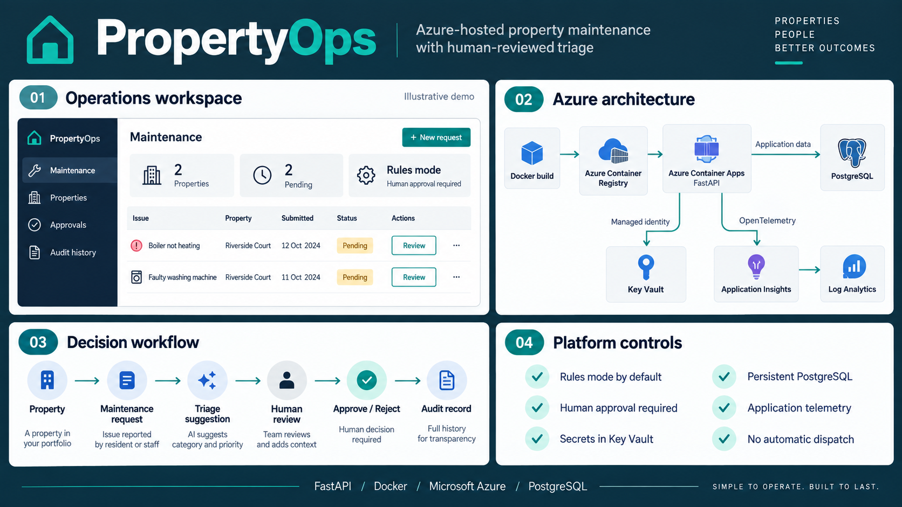
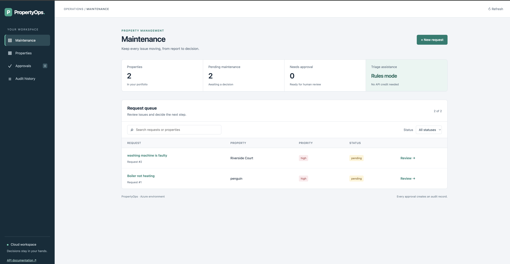
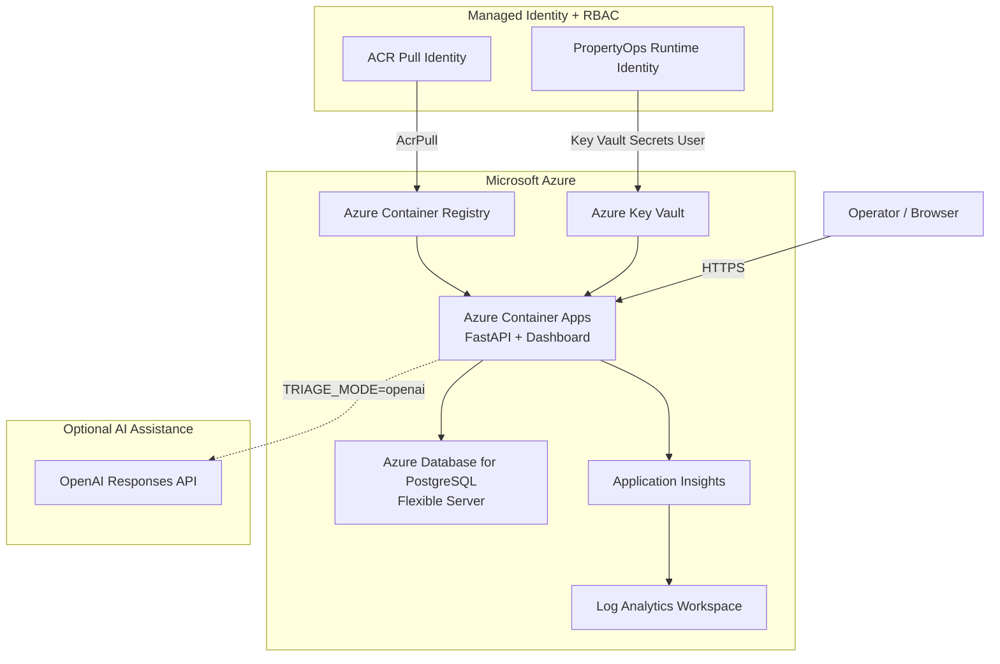
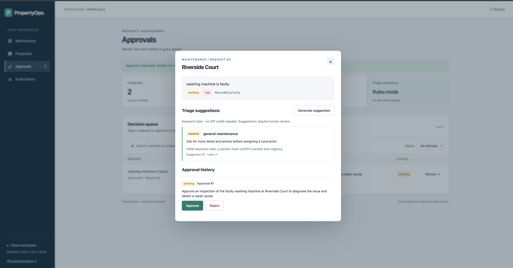
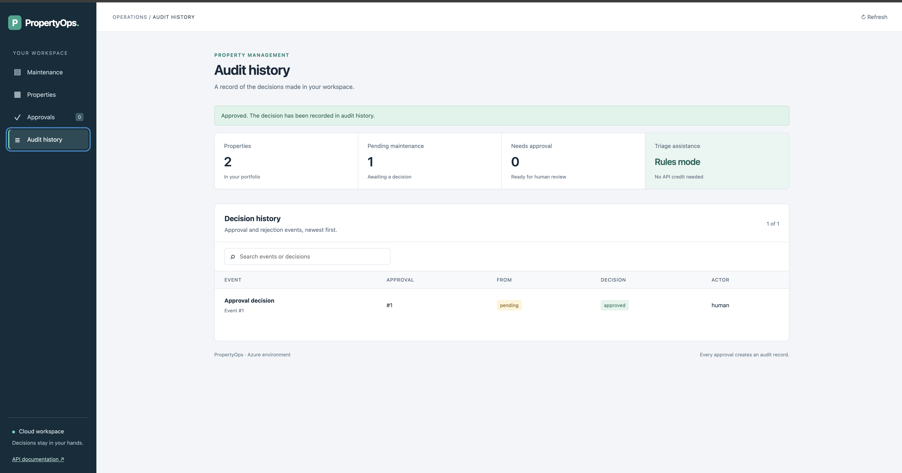
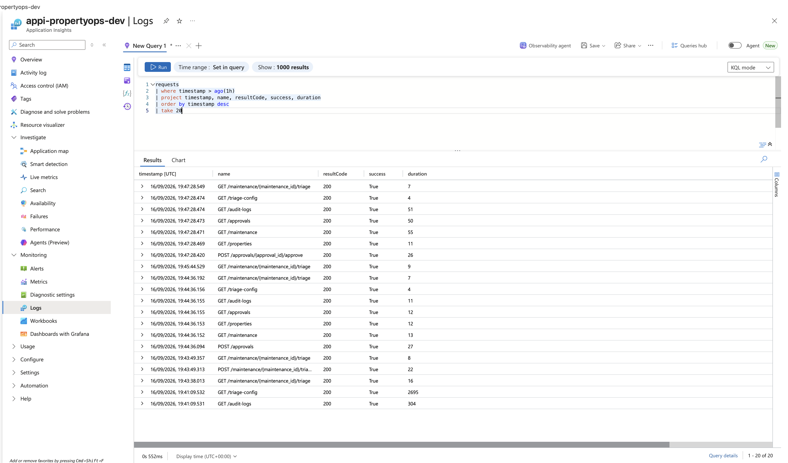
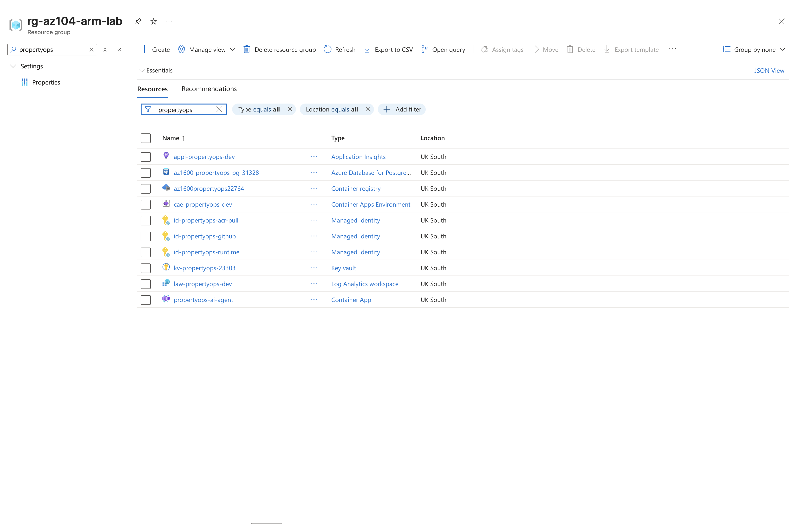

# PropertyOps AI Agent

PropertyOps is an Azure-hosted property operations platform for managing properties, maintenance requests, human-reviewed triage, approval decisions, and audit history.

The application combines a FastAPI backend with an operations dashboard and a controlled decision workflow. Local rules-based triage is available by default, while OpenAI-assisted suggestions can be enabled explicitly.

The Azure deployment adds containerized compute, persistent PostgreSQL storage, managed identity, Key Vault-backed secrets, restricted database access, and end-to-end application telemetry.

> **Deployment status:** Validated on Microsoft Azure  
> **Decision boundary:** Human approval remains required. Triage suggestions never approve or dispatch maintenance work.

---

## Project Overview

The overview below summarizes the operations workspace, Azure architecture, maintenance workflow, and platform safety controls.



---

## Problem It Solves

Property maintenance workflows can become fragmented across messages, spreadsheets, property records, contractor conversations, and informal approval decisions.

PropertyOps brings those steps into one reviewable workflow:

- Register managed properties
- Submit maintenance issues
- Generate structured triage suggestions
- Preserve human approval and rejection decisions
- Keep maintenance state synchronized with decisions
- Record approval events in an audit history
- Monitor API requests, latency, and failures

The objective is not to automate away operational judgment.

PropertyOps uses automation to organize recommendations while keeping consequential decisions with a human reviewer.

---

## Core Workflow

```text
Property
   ↓
Maintenance request
   ↓
Triage suggestion
   ↓
Human review
   ↓
Approval or rejection
   ↓
Maintenance state update
   ↓
Audit history
```

Triage and approval are intentionally separate.

A suggestion can recommend a priority, trade, or next action, but it cannot approve work, dispatch a contractor, or independently change the maintenance decision.

---

## Operations Workspace



The dashboard provides four operational views:

| Area | Responsibility |
| --- | --- |
| Maintenance | Create, search, filter, triage, and review maintenance requests |
| Properties | Register properties and view maintenance workload |
| Approvals | Review proposed work and explicitly approve or reject it |
| Audit history | Inspect recorded approval and rejection decisions |

The workspace also displays the selected triage mode so an operator can see whether suggestions are coming from deterministic rules or the optional AI integration.

---

## Azure Architecture



### Azure Components

| Service | Role |
| --- | --- |
| Azure Container Apps | Runs the containerized FastAPI application and dashboard |
| Azure Container Registry | Stores versioned application container images |
| Azure Database for PostgreSQL | Provides persistent application data |
| Azure Key Vault | Stores the PostgreSQL connection secret outside the application image and repository |
| Managed Identity | Allows Azure resources to authenticate without application passwords |
| Azure RBAC | Restricts ACR and Key Vault permissions to the required identities |
| Application Insights | Captures request telemetry, latency, result codes, and failures |
| Log Analytics | Provides KQL-based investigation of application telemetry |

---

## Persistence

PropertyOps supports two database modes.

### Local Development

```text
FastAPI
   ↓
SQLite
   ↓
propertyops.db
```

If `DATABASE_URL` is not configured, the application uses the local SQLite database.

### Azure Deployment

```text
Azure Container Apps
   ↓
DATABASE_URL
   ↓
Key Vault secret reference
   ↓
Azure Database for PostgreSQL
```

The Azure deployment uses PostgreSQL so application data survives container restarts, replica replacement, and scale events.

Persistence was validated by:

1. Creating property data
2. Restarting the active Azure Container Apps revision
3. Querying the application again
4. Confirming the stored property remained available

---

## Managed Identity and Secret Management

The deployed application does not embed the PostgreSQL credential in the container image or source repository.

```text
PropertyOps
   ↓
Runtime Managed Identity
   ↓
Azure Key Vault
   ↓
database-url
   ↓
PostgreSQL
```

The runtime identity has the:

```text
Key Vault Secrets User
```

role.

A separate managed identity has:

```text
AcrPull
```

permission for retrieving application images from Azure Container Registry.

This separates application runtime access from registry access and follows least-privilege RBAC principles.

---

## Database Network Access

The PostgreSQL server does not rely on the broad Azure-wide service firewall rule used during initial setup.

The deployment was hardened by allowing the current Container Apps outbound IP directly and removing the broad:

```text
Allow Azure services and resources to access this server
```

rule.

Database connectivity was then validated through the live `/properties` API endpoint.

> The current Container Apps Consumption egress IP is suitable for lab validation but is not intended as a permanent production networking design. A production version would use private networking and stable egress.

---

## Maintenance Triage

PropertyOps supports two triage modes.

### Rules Mode

```dotenv
TRIAGE_MODE=rules
```

Rules mode is the default and requires no external AI API.

It produces structured suggestions using deterministic local logic.

### OpenAI Mode

```dotenv
TRIAGE_MODE=openai
OPENAI_API_KEY=
OPENAI_MODEL=
```

OpenAI mode is explicitly enabled.

Suggestions can include:

- Priority
- Recommended trade
- Recommended action
- Rationale
- Suggestion source

AI responses remain recommendations only.

They do not automatically:

- Approve work
- Change maintenance status
- Create an approval decision
- Dispatch contractors

---

## Human Approval Boundary



The approval workflow remains independent of triage.

```text
Triage suggestion
       ↓
Human reviewer
       ↓
 ┌─────┴─────┐
 ↓           ↓
Approve    Reject
 ↓           ↓
Maintenance state
       ↓
Audit event
```

Approval and rejection update the linked maintenance request and create an audit event in the same database transaction.

Duplicate pending approvals and repeated decisions return HTTP `409`.

---

## Audit History



PropertyOps preserves approval decisions separately from triage suggestions.

This makes it possible to distinguish:

```text
what the system suggested
        from
what the human decided
```

That separation is central to the application's operational safety model.

---

## Observability

PropertyOps uses Azure Monitor OpenTelemetry instrumentation.

```text
FastAPI request
      ↓
OpenTelemetry
      ↓
Application Insights
      ↓
Log Analytics
      ↓
KQL investigation
```

Telemetry has been validated for:

- Successful `/health` requests
- PostgreSQL-backed `/properties` requests
- HTTP result codes
- Request latency
- Successful requests
- Failed requests such as HTTP `404`



Example KQL query:

```kusto
AppRequests
| where TimeGenerated > ago(30m)
| project TimeGenerated, Name, ResultCode, DurationMs, Success
| order by TimeGenerated desc
```

Example successful telemetry:

```text
GET /health       200    Success=True
GET /properties   200    Success=True
```

Failure telemetry was also validated using a deliberately invalid route:

```text
GET /does-not-exist   404   Success=False
```

This provides a practical troubleshooting path from a user request to measurable application behaviour.

---

## API Workflow

1. Create a property with `POST /properties`
2. Submit an issue with `POST /maintenance`
3. Generate triage with `POST /maintenance/{maintenance_id}/triage`
4. Request review with `POST /approvals`
5. Approve or reject using the approval decision endpoints
6. Inspect maintenance state and audit history

Useful read endpoints include:

```text
GET /health
GET /properties
GET /maintenance
GET /maintenance/{maintenance_id}/triage
GET /audit-logs
GET /triage-config
```

---

## Dashboard

The dashboard runs inside the FastAPI application with no separate frontend build.

Main areas include:

### Maintenance

Create requests, search and filter the queue, inspect request details, generate triage suggestions, and request approval.

### Properties

Create managed properties and view associated maintenance activity.

### Approvals

Review requests and explicitly approve or reject proposed work.

### Audit History

Inspect recorded approval and rejection events.

---

## Containerization

PropertyOps includes a Dockerfile using Python 3.11.

The container:

- Installs dependencies from `requirements.txt`
- Copies only required application code
- Runs as a non-root `appuser`
- Exposes port `8000`
- Starts FastAPI through Uvicorn
- Defaults to rules-based triage
- Supports PostgreSQL through `DATABASE_URL`
- Supports Application Insights through environment configuration

Build locally:

```bash
docker build \
  -t propertyops-ai-agent:local \
  .
```

Run locally:

```bash
docker run --rm \
  --name propertyops-local \
  -p 8000:8000 \
  propertyops-ai-agent:local
```

Verify:

```bash
curl http://127.0.0.1:8000/health
```

Expected response:

```json
{
  "status": "ok",
  "service": "propertyops-ai-agent"
}
```

---

## Azure Container Image

Azure deployment images are built for Linux AMD64:

```bash
docker build \
  --platform linux/amd64 \
  -t propertyops-ai-agent:azure \
  .
```

The image is stored in Azure Container Registry and deployed to Azure Container Apps.

The deployment has been validated using multiple versioned images during development.

---

## Local Development

Create a virtual environment:

```bash
python3 -m venv .venv
```

Activate it:

```bash
source .venv/bin/activate
```

Install dependencies:

```bash
pip install -r requirements.txt
```

Start the application:

```bash
python -m uvicorn app.main:app --reload
```

Open:

```text
Dashboard: http://127.0.0.1:8000/
API docs:  http://127.0.0.1:8000/docs
```

Local development uses SQLite unless `DATABASE_URL` is supplied.

---

## Configuration

| Variable | Purpose |
| --- | --- |
| `TRIAGE_MODE` | Selects `rules` or `openai` |
| `DATABASE_URL` | Selects PostgreSQL instead of local SQLite |
| `APPLICATIONINSIGHTS_CONNECTION_STRING` | Enables Azure Monitor OpenTelemetry export |
| `OPENAI_API_KEY` | Authenticates OpenAI requests when OpenAI mode is selected |
| `OPENAI_MODEL` | Selects the configured model for AI-assisted triage |

Environment secrets must not be committed to Git.

The root `.env` file is intended for local development only and is ignored by Git.

---

## Work Without API Credit

Triage defaults to `rules`, even if an API key exists.

To make the configuration explicit:

```dotenv
TRIAGE_MODE=rules
```

Rules mode makes no model requests.

Use:

```text
GET /triage-config
```

to inspect the configured mode.

The endpoint reveals no credentials and does not contact OpenAI.

---

## Enable AI Assistance

If starting fresh, copy `.env.example` to a file named `.env` in the project root.

Do not commit `.env`.

Example:

```dotenv
TRIAGE_MODE=openai
OPENAI_API_KEY=
OPENAI_MODEL=gpt-5-mini
```

OpenAI mode sends the maintenance issue text to the Responses API using structured output.

Saved suggestions identify their source as:

```text
openai:<model>
```

Missing keys, invalid modes, API errors, or refusals return HTTP `503` without silently falling back to rules mode.

Human approval remains separate from AI triage.

---

## Validation

Run the test suite:

```bash
python -m unittest discover -s tests -v
```

Current validation:

```text
12 tests passed

Docker image build validated
Linux AMD64 image validated
Azure Container Registry push validated
Azure Container Apps deployment validated
PostgreSQL persistence validated across revision restart
Restricted PostgreSQL firewall access validated
Managed Identity access validated
Azure Key Vault secret reference validated
Application Insights request telemetry validated
HTTP 404 failure telemetry validated
```

---

## Deployment Evidence



The Azure implementation demonstrates:

```text
Containerized application delivery
Persistent managed database
Managed identities
Azure RBAC
Centralized secret storage
Restricted database network access
Application telemetry
KQL-based troubleshooting
```

---

## Recommended Screenshot Set

The repository documentation is designed around the following evidence:

```text
docs/
├── propertyops-project-overview.png
└── screenshots/
    ├── maintenance-dashboard.png
    ├── approval-review.png
    ├── audit-history.png
    ├── azure-monitor-requests.png
    └── azure-platform-resources.png
```

### Project Overview

A single architecture and workflow graphic showing:

```text
Operations Workspace
Azure Architecture
Maintenance Workflow
Safety & Platform Controls
```

### Maintenance Dashboard

Shows the primary PropertyOps operations workspace.

### Approval Review

Shows the human decision boundary.

### Audit History

Shows recorded approval and rejection events.

### Azure Monitor Requests

Shows successful and failed API telemetry captured through Application Insights and Log Analytics.

### Azure Platform Resources

Shows the main Azure services supporting the deployment.

---

## Current Security Boundary

PropertyOps is an engineering and portfolio project, not a production property-management service.

Current limitations include:

- Application-level user authentication has not yet been added
- The audit actor is currently represented as `human`
- Optional AI triage depends on external model availability and configuration
- Rules-based triage cannot reliably understand every safety or contextual nuance
- The current Container Apps Consumption egress design is suitable for lab validation but is not the final production network architecture

Before exposing the deployment as a public production service, authentication and authorization should be added.

Microsoft Entra ID is the planned authentication layer.

---

## Technology Stack

### Application

- Python 3.11
- FastAPI
- SQLAlchemy
- Uvicorn

### Data

- SQLite for local development
- Azure Database for PostgreSQL Flexible Server for cloud persistence

### Containers

- Docker
- Azure Container Registry
- Azure Container Apps

### Identity and Security

- Azure Managed Identity
- Azure RBAC
- Azure Key Vault
- PostgreSQL firewall rules

### Observability

- OpenTelemetry
- Azure Application Insights
- Azure Log Analytics
- KQL

### Optional AI

- OpenAI Responses API
- Structured triage output
- Explicit opt-in through `TRIAGE_MODE`

---

## Skills Demonstrated

- **Azure cloud engineering:** Container Apps, ACR, PostgreSQL, Key Vault, identity, RBAC, monitoring, and networking
- **Platform engineering:** container delivery, runtime configuration, persistence, secret management, and operational controls
- **DevOps:** Docker image lifecycle, deployment validation, testing, and immutable image versions
- **Backend engineering:** FastAPI, SQLAlchemy, REST APIs, database transactions, and failure handling
- **Observability:** OpenTelemetry, Application Insights, Log Analytics, KQL, latency analysis, and failure investigation
- **Security:** managed identities, least-privilege RBAC, external secret storage, non-root containers, and restricted database access
- **Responsible automation:** human approval boundaries, explicit AI opt-in, audit records, and non-mutating recommendations

---

## Planned Improvements

```text
Microsoft Entra ID authentication
        ↓
Role-based application access
        ↓
GitHub Actions CI/CD with Azure OIDC
        ↓
Infrastructure as Code with Bicep
        ↓
Private Azure networking
        ↓
Stable outbound networking
```

---

## Author

**Olawale Azeez**

AWS Certified Developer – Associate

Cloud Engineer | Platform Engineer | DevOps Engineer