# PropertyOps AI Agent


PropertyOps is an Azure-hosted property operations platform for managing properties, maintenance requests, structured triage, human approval decisions, audit history, and production-style cloud infrastructure.

The project combines FastAPI, PostgreSQL, Microsoft Entra ID, application-role authorization, managed identities, Azure Key Vault, Azure Private Link, Private DNS, Application Insights, GitHub Actions with Azure OIDC, Docker, and modular Bicep Infrastructure as Code.

> **Deployment status:** Validated on Microsoft Azure
> **Authentication:** Microsoft Entra ID
> **Authorization:** `PropertyOps.User` and `PropertyOps.Manager`
> **Private networking:** PostgreSQL and Key Vault Private Endpoints deployed
> **Decision boundary:** Triage can recommend actions, but approval and rejection remain human decisions.

---

## Project Overview

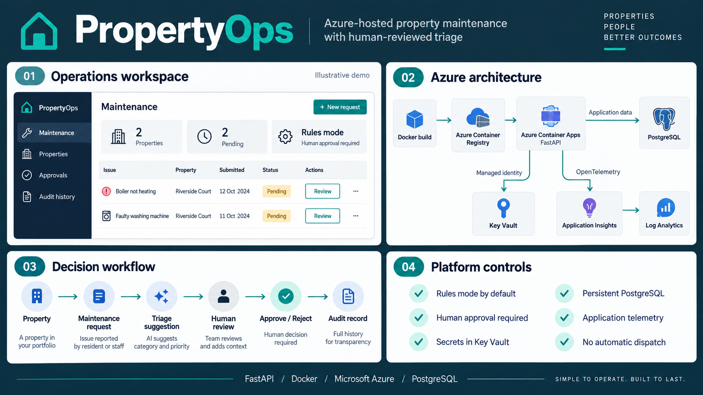

PropertyOps was built as a cloud engineering and platform engineering portfolio project rather than only as an application demo.

It demonstrates a production-style lifecycle:

```text
Application
    ↓
Containerization
    ↓
Azure deployment
    ↓
Managed database
    ↓
Identity + RBAC
    ↓
Secret management
    ↓
Private networking
    ↓
Observability
    ↓
CI/CD
    ↓
Infrastructure as Code
```

The application models a property maintenance workflow:

```text
Property
   ↓
Maintenance request
   ↓
Triage suggestion
   ↓
Human review
   ↓
Approve / Reject
   ↓
Maintenance state update
   ↓
Audit event
```

---

## Key Capabilities

- Property and maintenance-request management
- Searchable browser operations dashboard
- Deterministic rules-based triage
- Optional OpenAI-assisted triage
- Human approval and rejection workflow
- Audit history linked to authenticated users
- Microsoft Entra ID authentication
- Application-role authorization
- PostgreSQL cloud persistence
- Azure Key Vault secret references
- User-assigned managed identities
- Least-privilege Azure RBAC
- Dedicated PropertyOps virtual network
- PostgreSQL Private Endpoint
- Key Vault Private Endpoint
- Azure Private DNS
- Prepared Container Apps VNet subnet
- Application Insights telemetry
- Log Analytics / KQL investigation
- Docker containerization
- GitHub Actions CI/CD
- Passwordless Azure deployment using GitHub OIDC
- Modular Bicep Infrastructure as Code
- Azure What-If validation before infrastructure deployment

---

# Azure Architecture

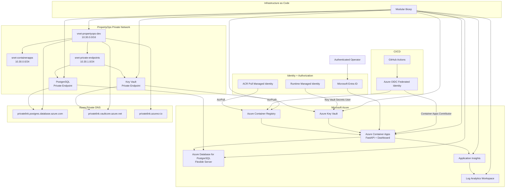
```mermaid
flowchart TB
    USER["Authenticated Operator"]

    subgraph Azure["Microsoft Azure"]
        ACA["Azure Container Apps<br/>FastAPI + Dashboard"]
        ACR["Azure Container Registry"]
        PG["Azure Database for PostgreSQL<br/>Flexible Server"]
        KV["Azure Key Vault"]
        AI["Application Insights"]
        LAW["Log Analytics Workspace"]

        ACR --> ACA
        ACA --> PG
        KV --> ACA
        ACA --> AI
        AI --> LAW
    end

    subgraph Network["PropertyOps Private Network"]
        VNET["vnet-propertyops-dev<br/>10.30.0.0/16"]
        ACA_SUBNET["snet-containerapps<br/>10.30.0.0/24"]
        PE_SUBNET["snet-private-endpoints<br/>10.30.1.0/24"]

        PGPE["PostgreSQL<br/>Private Endpoint"]
        KVPE["Key Vault<br/>Private Endpoint"]

        VNET --> ACA_SUBNET
        VNET --> PE_SUBNET
        PE_SUBNET --> PGPE
        PE_SUBNET --> KVPE
        PGPE --> PG
        KVPE --> KV
    end

    subgraph DNS["Azure Private DNS"]
        PGDNS["privatelink.postgres.database.azure.com"]
        KVDNS["privatelink.vaultcore.azure.net"]
        ACRDNS["privatelink.azurecr.io"]
    end

    PGPE --> PGDNS
    KVPE --> KVDNS
    VNET --> PGDNS
    VNET --> KVDNS
    VNET --> ACRDNS

    subgraph Identity["Identity + Authorization"]
        ENTRA["Microsoft Entra ID"]
        RUNTIME["Runtime Managed Identity"]
        ACRID["ACR Pull Managed Identity"]
    end

    USER --> ENTRA
    ENTRA --> ACA

    ACRID -->|"AcrPull"| ACR
    RUNTIME -->|"Key Vault Secrets User"| KV

    subgraph Delivery["CI/CD"]
        GH["GitHub Actions"]
        OIDC["Azure OIDC Federated Identity"]
    end

    GH --> OIDC
    OIDC -->|"AcrPush"| ACR
    OIDC -->|"Container Apps Contributor"| ACA

    subgraph IaC["Infrastructure as Code"]
        BICEP["Modular Bicep"]
    end

    BICEP --> VNET
    BICEP --> PGPE
    BICEP --> KVPE
    BICEP --> ACR
    BICEP --> KV
    BICEP --> PG
    BICEP --> ACA
    BICEP --> AI
    BICEP --> LAW
```

> The current Container Apps Environment still uses its existing Azure-managed network.
> The dedicated `snet-containerapps` subnet is prepared for a future VNet-integrated replacement environment.

---

# Operations Workspace

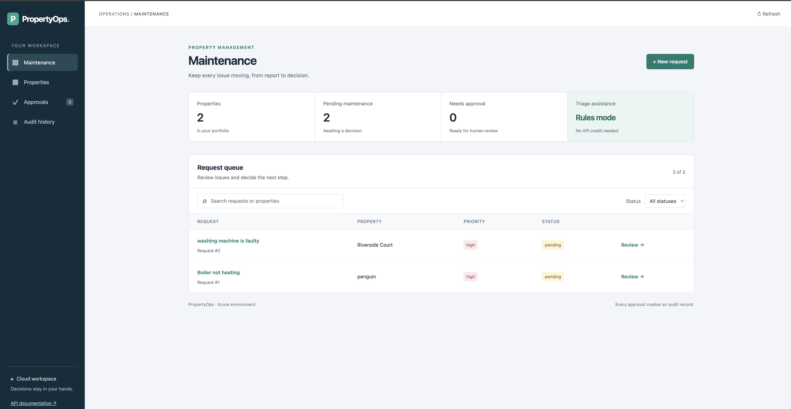

The browser workspace provides operational views for:

| Area | Purpose |
| --- | --- |
| Maintenance | Create, search, triage, and review maintenance requests |
| Properties | Register properties and inspect maintenance workload |
| Approvals | Review proposed work and explicitly approve or reject it |
| Audit history | Inspect recorded human decisions |
| Triage status | Show whether deterministic rules or optional AI assistance is configured |

The dashboard is served directly by FastAPI, so the project does not require a separate frontend deployment.

---

# Azure Platform

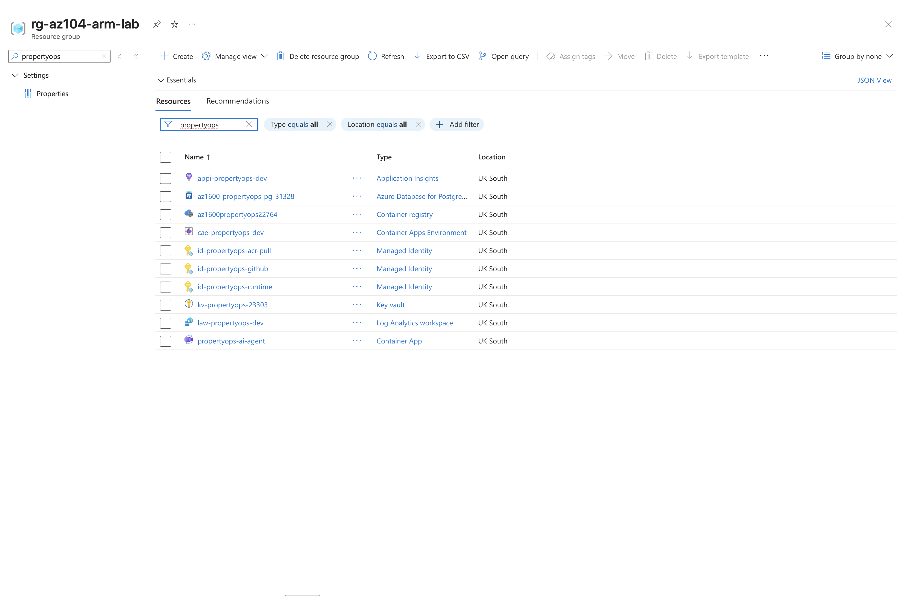

| Azure service | Responsibility |
| --- | --- |
| Azure Container Apps | Hosts the FastAPI application and dashboard |
| Azure Container Registry | Stores versioned Linux AMD64 container images |
| Azure Database for PostgreSQL | Provides persistent application storage |
| Azure Key Vault | Stores application secrets outside source control |
| Microsoft Entra ID | Authenticates application users |
| Managed Identity | Provides passwordless Azure resource authentication |
| Azure RBAC | Restricts identities to required resource actions |
| Azure Virtual Network | Provides the PropertyOps private network boundary |
| Azure Private Link | Provides private access paths to PostgreSQL and Key Vault |
| Azure Private DNS | Resolves private service endpoints inside the VNet |
| Application Insights | Captures application request telemetry |
| Log Analytics | Supports operational investigation with KQL |

---

# Private Networking

PropertyOps now has its own dedicated network instead of depending on the existing AZ-104 lab virtual networks.

```text
vnet-propertyops-dev
10.30.0.0/16
│
├── snet-containerapps
│   10.30.0.0/24
│   └── delegated to Microsoft.App/environments
│
└── snet-private-endpoints
    10.30.1.0/24
    ├── PostgreSQL Private Endpoint
    └── Key Vault Private Endpoint
```

This network does not overlap the existing:

```text
10.10.0.0/16
10.20.0.0/16
```

lab networks.

The Container Apps subnet is reserved for a future VNet-integrated managed environment.

The private-endpoint subnet hosts Private Link interfaces for Azure PaaS services.

---

# Private Endpoint Evidence

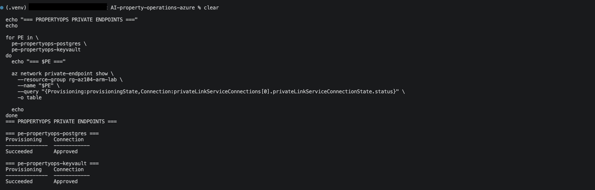

The deployed private endpoints were validated directly through Azure CLI.

```text
pe-propertyops-postgres
Provisioning: Succeeded
Connection:   Approved

pe-propertyops-keyvault
Provisioning: Succeeded
Connection:   Approved
```

Both endpoints receive addresses from:

```text
10.30.1.0/24
```

This establishes private network paths to PostgreSQL and Key Vault before the application itself is migrated into the VNet.

---

# Private DNS

The network contains dedicated Azure Private DNS zones:

```text
privatelink.postgres.database.azure.com
privatelink.vaultcore.azure.net
privatelink.azurecr.io
```

Each zone is linked to:

```text
vnet-propertyops-dev
```

using:

```text
registrationEnabled = false
```

Private Endpoint DNS zone groups automatically create the required PostgreSQL and Key Vault records.

The resulting design is:

```text
Application VNet
      ↓
Azure Private DNS
      ↓
Private Endpoint
      ↓
Azure PaaS service
```

The ACR zone is prepared for a future registry Private Link migration.

---

# PostgreSQL Private Connectivity

The existing PostgreSQL Flexible Server remains operational while a parallel Private Link path has been introduced.

```text
PostgreSQL Flexible Server
        │
        ├── Existing public endpoint
        │
        └── Private Endpoint
                ↓
           10.30.1.0/24
                ↓
privatelink.postgres.database.azure.com
```

The private connection has been validated as:

```text
ProvisioningState: Succeeded
ConnectionState:   Approved
```

A private DNS record is also present for the server.

Public network access currently remains:

```text
Enabled
```

This is intentional because the active Container Apps Environment has not yet been migrated into the PropertyOps VNet.

Public access will only be disabled after the VNet-integrated application environment has been proven operational.

---

# Key Vault Private Connectivity

Azure Key Vault also has a working Private Endpoint.

```text
Azure Key Vault
      │
      ├── Existing public endpoint
      │
      └── Private Endpoint
              ↓
         10.30.1.0/24
              ↓
privatelink.vaultcore.azure.net
```

The connection has been validated as:

```text
ProvisioningState: Succeeded
ConnectionState:   Approved
```

Private DNS registration has also been verified.

Public network access currently remains:

```text
Enabled
```

until the application workload can run inside the VNet.

This migration order prevents the current Container App from losing access to its Key Vault-backed database secret.

---

# Azure Container Registry Networking

The project creates and links:

```text
privatelink.azurecr.io
```

in preparation for a future Azure Container Registry Private Endpoint.

The current registry uses:

```text
Basic
```

SKU.

Azure Container Registry Private Link requires a compatible Premium registry tier, so the repository intentionally stops short of creating the ACR Private Endpoint during this phase.

This avoids introducing additional recurring cost before the VNet-integrated Container Apps environment can consume that private path.

---

# Safe Network Migration Strategy

The networking work is intentionally incremental.

```text
Phase 1
Create dedicated VNet
        ↓
Create Container Apps subnet
        ↓
Create Private Endpoint subnet
        ↓
Create Private DNS zones

Phase 2
Create PostgreSQL Private Endpoint
        ↓
Validate connection + DNS

Phase 3
Create Key Vault Private Endpoint
        ↓
Validate connection + DNS

Phase 4
Create replacement VNet-integrated
Container Apps Environment
        ↓
Validate application

Phase 5
Disable unnecessary public access
        ↓
Add stable outbound networking
```

The current environment was not destroyed or modified just to force private networking.

This preserves the working application while the new network path is built and validated independently.

---

# Container Apps Environment Constraint

The current Azure subscription was checked directly for regional Container Apps usage.

At the time of validation:

```text
Managed Environment Count

Current: 1
Limit:   1
```

The existing environment:

```text
cae-propertyops-dev
```

is not VNet-integrated.

Azure Container Apps managed environments cannot simply be retrofitted from the default Azure network onto a custom VNet.

A safe migration therefore requires a replacement environment.

Because the regional managed-environment quota is currently exhausted, the existing working environment has intentionally been preserved.

The prepared subnet is:

```text
snet-containerapps
10.30.0.0/24
delegation: Microsoft.App/environments
```

Once quota permits a second environment, it can be used for the VNet-integrated migration.

---

# Authentication and Authorization

PropertyOps uses Microsoft Entra ID for authentication in Azure.

The Azure authentication layer supplies the authenticated principal to the application. FastAPI reads that principal and extracts the user's claims and application roles.

Two application roles are used:

```text
PropertyOps.User
PropertyOps.Manager
```

## `PropertyOps.User`

Authenticated users can:

- View properties
- Create properties
- View maintenance requests
- Submit maintenance requests
- Generate triage suggestions
- Create approval requests
- View approvals
- View audit history

## `PropertyOps.Manager`

Managers inherit normal user access and can additionally:

- Approve maintenance work
- Reject maintenance work

The application exposes:

```text
GET /me
```

which returns the authenticated actor and application roles without exposing credentials.

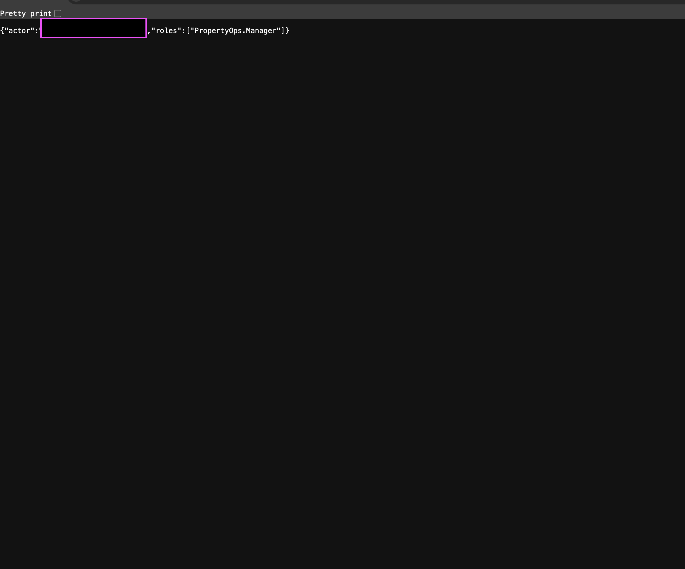

Example:

```json
{
  "actor": "authenticated-user",
  "roles": [
    "PropertyOps.Manager"
  ]
}
```

Personally identifying account information is redacted from public evidence.

---

# Human Approval Boundary

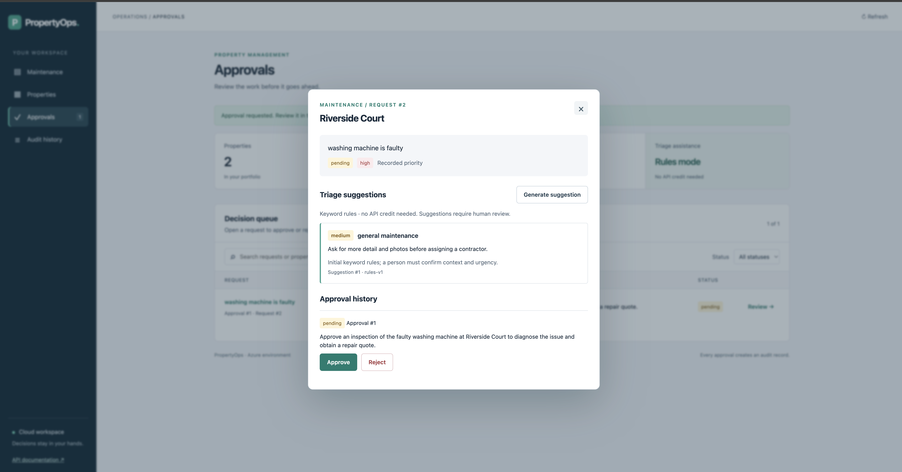

Triage and approval are intentionally separate.

```text
Maintenance issue
       ↓
Triage suggestion
       ↓
Human reviewer
       ↓
 ┌─────┴─────┐
 ↓           ↓
Approve    Reject
 ↓           ↓
Maintenance state
       ↓
Audit history
```

A triage suggestion may recommend:

- Priority
- Recommended trade
- Recommended action
- Rationale

It cannot independently:

- Approve work
- Reject work
- Dispatch a contractor
- Change the final maintenance decision

Approval and rejection require:

```text
PropertyOps.Manager
```

Duplicate pending approval requests and repeated decisions return HTTP `409`.

This preserves a clear human decision boundary even when AI-assisted triage is enabled.

---

# Audit History

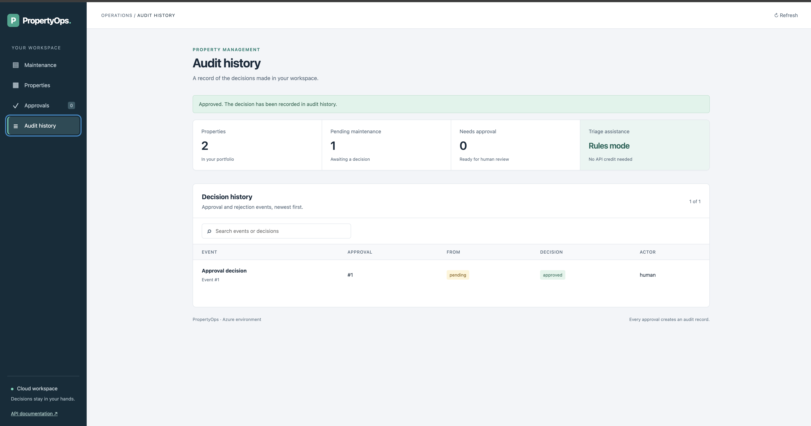

Approval and rejection decisions are recorded independently from triage suggestions.

Each decision records information such as:

```text
Action
Resource
Previous status
New status
Authenticated actor
```

This preserves the distinction between:

```text
what the system suggested
```

and:

```text
what the authenticated human decided
```

Manager approval and rejection use the authenticated Microsoft Entra actor instead of a hard-coded application username.

---

# Triage Modes

PropertyOps supports two triage modes.

## Rules mode

```dotenv
TRIAGE_MODE=rules
```

Rules mode uses deterministic local logic and requires no external AI API.

## OpenAI mode

```dotenv
TRIAGE_MODE=openai
OPENAI_API_KEY=
OPENAI_MODEL=
```

AI-assisted triage can produce:

- Priority
- Recommended trade
- Recommended action
- Rationale
- Suggestion source

AI remains advisory.

It cannot independently approve work or change the final maintenance decision.

If OpenAI mode is selected but unavailable or misconfigured, the application returns an error rather than silently switching to rules mode.

Use:

```text
GET /triage-config
```

to inspect the selected mode without revealing credentials.

---

# Persistence

PropertyOps supports separate local and Azure persistence models.

## Local development

Without `DATABASE_URL`:

```text
FastAPI
   ↓
SQLite
   ↓
propertyops.db
```

## Azure deployment

```text
Azure Container Apps
       ↓
DATABASE_URL
       ↓
Container App secret reference
       ↓
Azure Key Vault
       ↓
PostgreSQL
```

PostgreSQL persistence was validated across Container Apps revision replacement and restart.

Application records remain available independently of an individual container instance.

---

# Managed Identity and Secret Management

Application credentials are not embedded in the Docker image or committed to Git.

The database secret path is:

```text
PropertyOps Container App
        ↓
Runtime Managed Identity
        ↓
Key Vault Secrets User
        ↓
Azure Key Vault
        ↓
database-url
```

A separate identity handles container image retrieval:

```text
Container App
     ↓
ACR Pull Identity
     ↓
AcrPull
     ↓
Azure Container Registry
```

Separating runtime and registry identities reduces the permissions available to each identity.

---

# Azure RBAC

```text
id-propertyops-acr-pull
    └── AcrPull
        └── Azure Container Registry

id-propertyops-runtime
    └── Key Vault Secrets User
        └── Azure Key Vault

GitHub Actions OIDC principal
    ├── AcrPush
    │   └── Azure Container Registry
    │
    └── Container Apps Contributor
        └── PropertyOps Container App
```

Role assignments are represented in Bicep.

Existing assignment resource IDs were preserved during IaC adoption to prevent duplicate relationships.

---

# GitHub Actions CI/CD

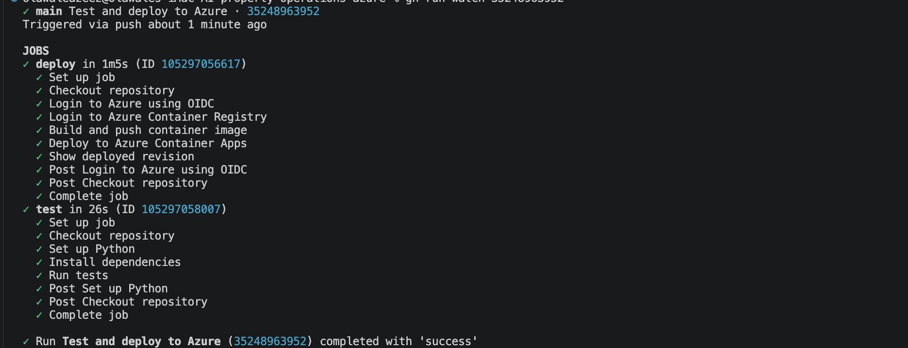

## Pull requests

```text
Checkout
   ↓
Python 3.11
   ↓
Install dependencies
   ↓
pytest
```

Deployment does not run for pull-request events.

## Main branch

```text
Tests
  ↓
GitHub OIDC
  ↓
Azure login
  ↓
ACR login
  ↓
Build Linux AMD64 image
  ↓
Push commit-SHA image
  ↓
Deploy to Azure Container Apps
```

Azure authentication uses workload identity federation rather than a long-lived client secret.

Container images are tagged using the Git commit SHA.

---

# Infrastructure as Code

Azure infrastructure is represented with modular Bicep.

```text
infra/
├── main.bicep
└── modules/
    ├── acr.bicep
    ├── container-app.bicep
    ├── container-environment.bicep
    ├── identities.bicep
    ├── key-vault.bicep
    ├── key-vault-private-endpoint.bicep
    ├── monitoring.bicep
    ├── network.bicep
    ├── postgres.bicep
    ├── postgres-private-endpoint.bicep
    ├── private-dns.bicep
    └── rbac.bicep
```

Infrastructure is adopted and extended incrementally.

```text
Inspect Azure
      ↓
Represent configuration in Bicep
      ↓
az bicep build
      ↓
az deployment group what-if
      ↓
Review exact changes
      ↓
Deploy
      ↓
Verify live state
      ↓
Pull request
```

Managed infrastructure now includes:

- Azure Container Registry
- User-assigned managed identities
- Log Analytics Workspace
- Application Insights
- Container Apps Environment
- Azure Key Vault
- PostgreSQL Flexible Server
- PostgreSQL application database
- PostgreSQL firewall rule
- Azure Container App
- Azure RBAC role assignments
- PropertyOps Virtual Network
- Container Apps delegated subnet
- Private Endpoint subnet
- PostgreSQL Private Endpoint
- Key Vault Private Endpoint
- PostgreSQL Private DNS
- Key Vault Private DNS
- ACR Private DNS foundation

---

# Infrastructure Validation

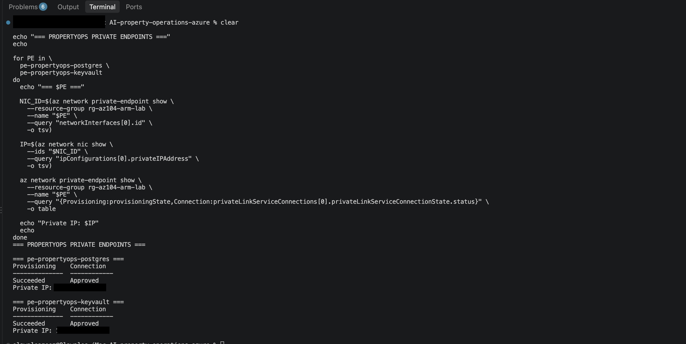

The networking modules were validated with:

```bash
az bicep build --file infra/modules/network.bicep
az bicep build --file infra/modules/private-dns.bicep
az bicep build --file infra/modules/postgres-private-endpoint.bicep
az bicep build --file infra/modules/key-vault-private-endpoint.bicep
az bicep build --file infra/main.bicep
```

Before deployment, each infrastructure slice was also reviewed using Azure What-If.

Application validation produced:

```text
11 passed
20 subtests passed
```

The remaining test output consists of dependency deprecation warnings rather than application test failures.

Whitespace validation also passes:

```bash
git diff --check
```

---

# Observability

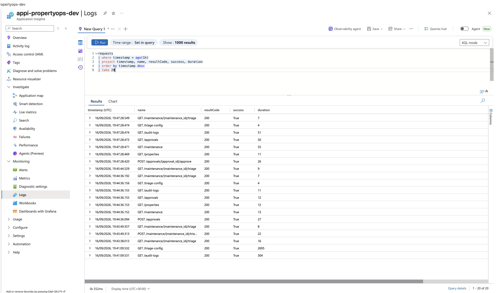

PropertyOps uses Azure Monitor OpenTelemetry instrumentation.

```text
FastAPI request
      ↓
OpenTelemetry
      ↓
Application Insights
      ↓
Log Analytics
      ↓
KQL investigation
```

Telemetry has been validated for:

- Successful requests
- Failed requests
- HTTP result codes
- Request latency
- `/health`
- PostgreSQL-backed API requests
- Deliberate HTTP `404` failures

Example KQL:

```kusto
AppRequests
| where TimeGenerated > ago(30m)
| project TimeGenerated, Name, ResultCode, DurationMs, Success
| order by TimeGenerated desc
```

---

# API Workflow

```text
POST /properties
        ↓
POST /maintenance
        ↓
POST /maintenance/{id}/triage
        ↓
POST /approvals
        ↓
POST /approvals/{id}/approve
        or
POST /approvals/{id}/reject
        ↓
GET /audit-logs
```

Useful endpoints:

```text
GET  /health
GET  /me
GET  /triage-config

GET  /properties
POST /properties

GET  /maintenance
POST /maintenance

POST /maintenance/{id}/triage
GET  /maintenance/{id}/triage

GET  /approvals
POST /approvals

POST /approvals/{id}/approve
POST /approvals/{id}/reject

GET  /audit-logs
```

---

# Containerization

PropertyOps uses Python 3.11 and Docker.

The image:

- installs dependencies from `requirements.txt`
- runs as a non-root user
- exposes port `8000`
- starts FastAPI through Uvicorn
- supports SQLite locally
- supports PostgreSQL through `DATABASE_URL`
- supports Application Insights configuration
- defaults to deterministic rules-based triage

Build:

```bash
docker build \
  -t propertyops-ai-agent:local \
  .
```

Run:

```bash
docker run --rm \
  --name propertyops-local \
  -p 8000:8000 \
  propertyops-ai-agent:local
```

Verify:

```bash
curl http://127.0.0.1:8000/health
```

Expected:

```json
{
  "status": "ok",
  "service": "propertyops-ai-agent"
}
```

---

# Local Development

```bash
python3 -m venv .venv
source .venv/bin/activate
pip install -r requirements.txt

python -m uvicorn app.main:app --reload
```

Open:

```text
Dashboard: http://127.0.0.1:8000/
API docs:  http://127.0.0.1:8000/docs
```

Local development uses SQLite unless `DATABASE_URL` is configured.

---

# Configuration

| Variable | Purpose |
| --- | --- |
| `TRIAGE_MODE` | Selects `rules` or `openai` |
| `DATABASE_URL` | Enables PostgreSQL instead of local SQLite |
| `APPLICATIONINSIGHTS_CONNECTION_STRING` | Enables Azure Monitor telemetry |
| `OPENAI_API_KEY` | Authenticates optional OpenAI triage |
| `OPENAI_MODEL` | Selects the AI model |

Secrets must not be committed to Git.

Local `.env` files are ignored.

---

# Testing

Run:

```bash
python -m pytest -q
```

The test suite covers:

- deterministic triage
- AI triage behaviour
- dashboard delivery
- property workflows
- maintenance workflows
- approval behaviour
- audit behaviour
- failure handling

Current validation:

```text
11 passed
20 subtests passed
```

---

# Repository Structure

```text
AI-property-operations/
├── .github/
│   └── workflows/
│       └── deploy.yml
│
├── app/
│   ├── ai_triage.py
│   ├── auth.py
│   ├── database.py
│   ├── main.py
│   ├── models.py
│   ├── schemas.py
│   ├── triage.py
│   └── static/
│
├── docs/
│   ├── propertyops-project-overview.png
│   └── screenshots/
│       ├── approval-review.png
│       ├── audit-history.png
│       ├── azure-monitor-requests.png
│       ├── azure-platform-resources.png
│       ├── entra-role-authentication.png
│       ├── github-actions-oidc-deployment.png
│       ├── maintenance-dashboard.png
│       ├── private-endpoints.png
│       └── private-networking-validation.png
│
├── infra/
│   ├── main.bicep
│   └── modules/
│       ├── acr.bicep
│       ├── container-app.bicep
│       ├── container-environment.bicep
│       ├── identities.bicep
│       ├── key-vault.bicep
│       ├── key-vault-private-endpoint.bicep
│       ├── monitoring.bicep
│       ├── network.bicep
│       ├── postgres.bicep
│       ├── postgres-private-endpoint.bicep
│       ├── private-dns.bicep
│       └── rbac.bicep
│
├── tests/
├── Dockerfile
├── requirements.txt
└── README.md
```

---

# Portfolio Evidence

## Application

```text
docs/propertyops-project-overview.png
docs/screenshots/maintenance-dashboard.png
docs/screenshots/approval-review.png
docs/screenshots/audit-history.png
```

## Identity and deployment

```text
docs/screenshots/entra-role-authentication.png
docs/screenshots/github-actions-oidc-deployment.png
```

## Observability

```text
docs/screenshots/azure-monitor-requests.png
```

## Azure platform

```text
docs/screenshots/azure-platform-resources.png
```

## Private networking

```text
docs/screenshots/private-endpoints.png
docs/screenshots/private-networking-validation.png
```

These show:

```text
Dedicated VNet
Private Endpoint subnet
PostgreSQL Private Link
Key Vault Private Link
Approved endpoint connections
Private DNS
Bicep validation
Passing application tests
```

---

# Security and Platform Controls

```text
✓ Microsoft Entra ID authentication
✓ Application-role authorization
✓ Manager-only approval and rejection
✓ Authenticated audit actors
✓ User-assigned managed identities
✓ Resource-scoped Azure RBAC
✓ Key Vault-backed database secret
✓ GitHub Actions OIDC
✓ No long-lived Azure CI/CD client secret
✓ Restricted PostgreSQL firewall access
✓ Dedicated PropertyOps VNet
✓ PostgreSQL Private Endpoint
✓ Key Vault Private Endpoint
✓ Azure Private DNS
✓ Dedicated Private Endpoint subnet
✓ Prepared Container Apps delegated subnet
✓ Application telemetry
✓ Infrastructure as Code
✓ Azure What-If change review
```

---

# Engineering Decisions

## Human decisions remain authoritative

Triage recommendations and approval decisions are stored separately.

```text
System suggestion
        ≠
Human decision
```

## Application roles protect consequential actions

Normal operations use:

```text
PropertyOps.User
```

Approval and rejection require:

```text
PropertyOps.Manager
```

## Separate managed identities

Registry image retrieval and application secret retrieval use separate identities.

## OIDC instead of deployment passwords

GitHub Actions authenticates through Azure workload identity federation.

## Dedicated project networking

PropertyOps uses its own `10.30.0.0/16` VNet instead of sharing infrastructure owned by another portfolio project.

## Private networking is introduced before public access is removed

Private Endpoints and DNS were deployed and validated while the current application remained operational.

This avoids creating an outage merely to demonstrate Private Link.

## Infrastructure changes are reviewed before deployment

```text
Bicep build
    ↓
Azure What-If
    ↓
Review
    ↓
Deploy
    ↓
Verify
```

## Cost-aware ACR migration

The ACR Private DNS zone is prepared, but the registry is not upgraded solely to create a Private Endpoint before the application can consume it.

---

# Technology Stack

## Application

- Python 3.11
- FastAPI
- SQLAlchemy
- Uvicorn

## Data

- SQLite
- Azure Database for PostgreSQL Flexible Server

## Azure

- Azure Container Apps
- Azure Container Registry
- Azure Database for PostgreSQL
- Azure Key Vault
- Azure Virtual Network
- Azure Private Link
- Azure Private DNS
- Microsoft Entra ID
- Managed Identity
- Azure RBAC
- Application Insights
- Log Analytics

## DevOps and Platform

- Docker
- GitHub Actions
- GitHub OIDC
- Azure CLI
- Bicep
- Azure What-If

## Optional AI

- OpenAI Responses API
- Structured triage
- Explicit opt-in through `TRIAGE_MODE`

---

# Skills Demonstrated

- Azure cloud engineering
- Infrastructure as Code
- Bicep
- Azure Virtual Network design
- subnet planning
- Private Endpoints
- Azure Private Link
- Private DNS
- safe network migration
- identity and access management
- Microsoft Entra ID
- application roles
- Azure RBAC
- Managed Identity
- Azure Key Vault
- workload identity federation
- GitHub Actions
- Docker
- Azure Container Apps
- PostgreSQL administration
- FastAPI backend engineering
- REST API design
- SQLAlchemy
- application observability
- Azure Monitor
- Application Insights
- Log Analytics
- KQL
- human-in-the-loop AI workflows

---

# Current Limitations

The project deliberately documents infrastructure that is not yet presented as fully production-complete.

Current limitations include:

- the active Container Apps Environment is not yet VNet-integrated
- PostgreSQL public network access remains enabled during the migration
- Key Vault public network access remains enabled during the migration
- the current regional Container Apps managed-environment quota is `1/1`
- ACR Private Link has not yet been enabled
- the current ACR uses the Basic tier
- stable outbound egress through NAT Gateway has not yet been implemented
- additional network security policy can be added after workload migration
- dependency deprecation warnings remain in the Python test environment

These are documented as migration boundaries rather than represented as completed production controls.

---

# Roadmap

Completed networking work:

```text
[Complete] Dedicated PropertyOps VNet
[Complete] Container Apps delegated subnet
[Complete] Private Endpoint subnet
[Complete] PostgreSQL Private DNS
[Complete] Key Vault Private DNS
[Complete] ACR Private DNS foundation
[Complete] PostgreSQL Private Endpoint
[Complete] PostgreSQL DNS registration
[Complete] Key Vault Private Endpoint
[Complete] Key Vault DNS registration
[Complete] Azure What-If validation
[Complete] Private networking evidence
```

Next improvements:

```text
[Next] Obtain capacity for replacement Container Apps Environment
[Next] Deploy VNet-integrated Container Apps Environment
[Next] Validate application through private PostgreSQL connectivity
[Next] Validate Key Vault access through private networking
[Next] Disable PostgreSQL public access
[Next] Disable unnecessary Key Vault public access
[Next] Add NAT Gateway for stable outbound egress
[Future] Evaluate ACR Premium + Private Link
[Future] Add automated Bicep validation to CI
[Future] Add additional operational alerts
[Future] Add deployment approval environments
[Future] Add custom domain and managed certificate
```

---

# Project Status

PropertyOps currently demonstrates:

```text
FastAPI application
+
PostgreSQL persistence
+
Microsoft Entra authentication
+
Application-role authorization
+
Human approval boundary
+
Managed Identity
+
Azure Key Vault
+
Azure RBAC
+
Dedicated VNet
+
Private Endpoints
+
Private DNS
+
Application Insights
+
Log Analytics
+
GitHub Actions
+
Azure OIDC
+
Docker
+
Modular Bicep
+
Azure What-If
```

The objective is not simply to demonstrate that the application runs.

The project demonstrates how an application can be:

```text
designed
deployed
authenticated
authorized
secured
networked
observed
automated
validated
and progressively hardened
```

using repeatable Azure cloud-engineering practices.

---

# Author

**Olawale Azeez**

AWS Certified Developer – Associate
Cloud Engineer | Platform Engineer | DevOps Engineer